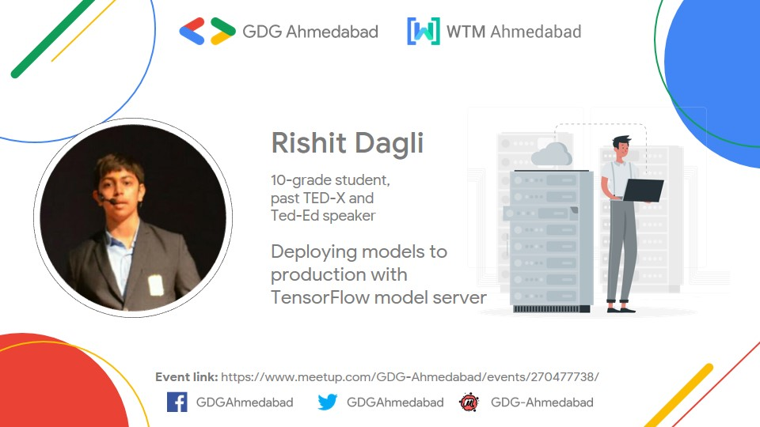

# GDG-Ahmedabad-2020

My session at Google Developers Group Ahmedabad about **Deploying models to production with TensorFlow model server**, 30 May 2020. Special thanks to [Hiren Dave](https://twitter.com/hjdave) and [Paresh Mayani](https://twitter.com/pareshmayani) for hosting me.

<h3> <a href="https://www.meetup.com/GDG-Ahmedabad/events/270477738/">Event Announcement</a></h3>

  
  

  
Credits

  Poster designed by Vatsal Trivedi- https://twitter.com/trivedivatsal_
  

