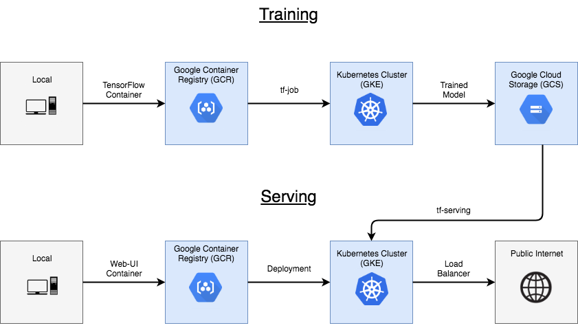
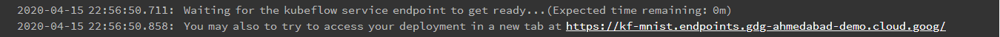
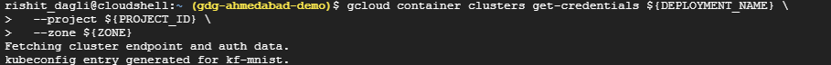
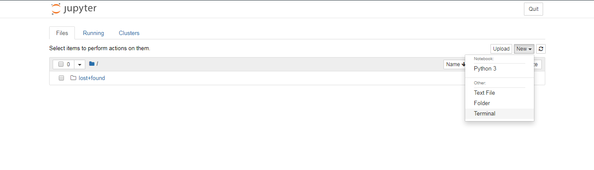

# Serve Model on Cloud with KubeFlow and TF Model server

Fortunately, distributed workloads are becoming easier to manage, thanks to Kubernetes. Kubernetes is a mature, production ready platform 
that gives developers a simple API to deploy programs to a cluster of machines as if they were a single piece of hardware. Using Kubernetes
, computational resources can be added or removed as desired, and the same cluster can be used to both train and serve ML models.

## What will we do

This guide will describe how to train and serve a TensorFlow model, and then how to deploy a web interface to allow users to interact 
with the model over the public internet. You will build a classic handwritten digit recognizer using the MNIST dataset.

We will use the following workflow to do so:



We will discretely follow these steps:

- Build a training image using your TensorFlow model code and Kubeflow's Fairing.
- Set up and run a distributed training job using TFJob.
- **Serve the resulting model using TensorFlow Serving.**
- Deploy a web app that uses the model

## What you need

- An active GCP project
- Basic TF Model server knowledge
- Basic model building knowledge in Keras

## Project setup

- Make sure you have selected a project
- Set an environment variable called `DEPLOYMENT_NAME`

```bash
export DEPLOYMENT_NAME = kf-mnist
```

- Ensure you set a zone
- Enable few APIs, you would need to enable a few APIs run this in the cloud shell to do so:

```bash
gcloud services enable \
  cloudresourcemanager.googleapis.com \
  iam.googleapis.com \
  file.googleapis.com \
  ml.googleapis.com
```

This might take a minute or so to run.

### Set up OAuth Client

* Navigate to [Oauth Consent Screen](https://console.cloud.google.com/apis/credentials/consent)
  * In the Application name box, enter the name of your application
  * Under Authorized domains, enter `<project_id>.cloud.goog`
  * Save it
* Naviagte to [Credentials screen](https://console.cloud.google.com/apis/credentials)
  * Click Create credentials, and then click OAuth client ID.
  * Under Application type, select Web application.
  * In the Name box enter any name for your OAuth client ID. This is not the name of your application nor the name of your Kubeflow deployment. It’s just a way to help you identify the OAuth client ID.
* Click Create > Copy the client ID
* On the Create credentials screen, find your newly created OAuth credential and click the pencil icon to edit it
* In the Authorized redirect URIs box, enter the following:

```
https://iap.googleapis.com/v1/oauth/clientIds/<CLIENT_ID>:handleRedirect
```

  * `<CLIENT_ID>` is the OAuth client ID that you copied from the dialog box in step four. It looks like `XXX.apps.googleusercontent.com`.
  * Note that the URI is not dependent on the Kubeflow deployment or endpoint. Multiple Kubeflow deployments can share the same OAuth client without the need to modify the redirect URIs.
* Save it
* Make a note of client ID and client secret, we will be using that

## Create a Kubeflow cluster

### Create a cluster

Create a managed Kubernetes cluster on Kubernetes Engine by visiting the Kubeflow Click-to-Deploy site in your browser and signing in 
with your GCP account

[Kubeflow Click-to-Deploy](https://deploy.kubeflow.cloud/)

* Project: Enter your GCP `$PROJECT_ID` in the top field
* Deployment name: Set the default value to `kf-mnist`.
* In the Choose how to connect to kubeflow service dropdown, select `"Login with GCP IAP"`. Then, for the IAP client ID and client secret fields, enter the OAuth credentials that you created in the previous section.
* GKE Zone: Use the value you have set for `$ZONE`, selecting it from the pulldown.
* Kubeflow Version: `v1.0.0` or greater

Generate the cluster by clicking Create Deployment. This will create a deployment object with everything necessary for installing Kubeflow, e.g. GKE resource requirements, service accounts, etc. You should receive something like this



### Set Up `kubectl`

When the cluster has been created, connect your environment to the Kubernetes Engine cluster by running the following command in your Cloud Shell:

```bash
gcloud container clusters get-credentials ${DEPLOYMENT_NAME} \
  --project ${PROJECT_ID} \
  --zone ${ZONE}
```



This configures your kubectl context so that you can interact with your cluster. To verify the connection, run the following command:
```bash
kubectl get nodes -o wide
```

You should see two nodes listed, both with a status of `Ready`, and other information about node age, version, external IP address, OS image, kernel version, and container runtime.

### Connecting to KubeFlow dashboard

When the IAP endpoint is set up, the deployment web app should redirect you to the Kubeflow Dashboard. You can also click the Kubeflow Service Endpoint button to be redirected.


## Set up a Kubeflow Jupyter notebook server

You can interactively define and run Kubeflow Pipelines from a Jupyter notebook. To create a notebook, navigate to the Notebook Servers
link on the central Kubeflow dashboard.

* click on **NEW SERVER**.
* Give your server a name, select the TensorFlow 1.15.x cpu image, and leave all other settings on defaults as below
* Click the LAUNCH button, which generates a new pod in your cluster
* After a few minutes, your notebook server will be up and running
* click **CONNECT** to connect
* After you have connected, open a terminal.


