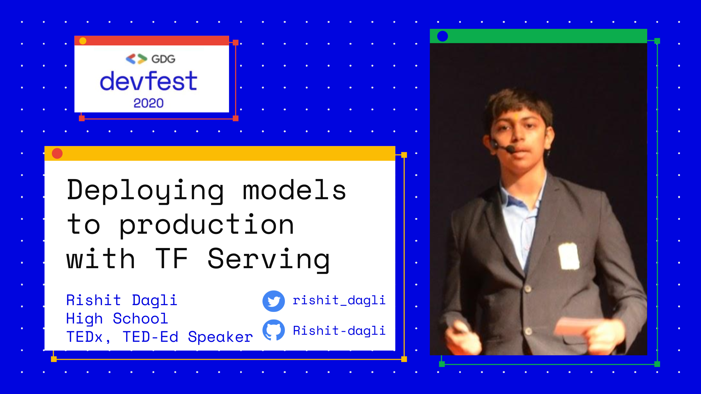

## TF Evrywhere India

### [Event Announcement](http://tfeverywhere.web.app/)

### [Tweet](https://twitter.com/TFUGIndia/status/1361280469795368965?s=20)

### [Slides](http://bit.ly/serving-deck)

## Devfest Kenya

### [Event Announcement](https://gdg.community.dev/events/details/google-gdg-nairobi-presents-gdg-kenya-devfest-2020/#/)

### [Blog](https://towardsdatascience.com/deploying-models-to-production-with-tensorflow-model-server-225a81859031)

## GDG-Ahmedabad-2020 

My session at [Google Developers Group Ahmedabad](https://gdgahmedabad.com/) about **Deploying models to production with TensorFlow model server**, 30 May 2020. Special thanks to [Hiren Dave](https://twitter.com/hjdave) and [Paresh Mayani](https://twitter.com/pareshmayani) for hosting me.

### [Event Announcement](https://www.meetup.com/GDG-Ahmedabad/events/270477738/)

### [Slides](https://github.com/Rishit-dagli/GDG-Ahmedabad-2020/blob/master/Deploying%20models%20to%20production%20with%20TensorFlow%20model%20server%20(1).pdf)

### [Blog](https://towardsdatascience.com/deploying-models-to-production-with-tensorflow-model-server-225a81859031)

### [Recording](https://www.youtube.com/watch?v=SD5ePd6ouuY)

  
  

  
Credits

  Poster designed by Vatsal Trivedi- https://twitter.com/trivedivatsal_
  

